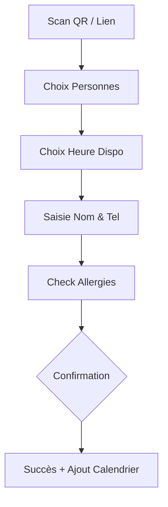
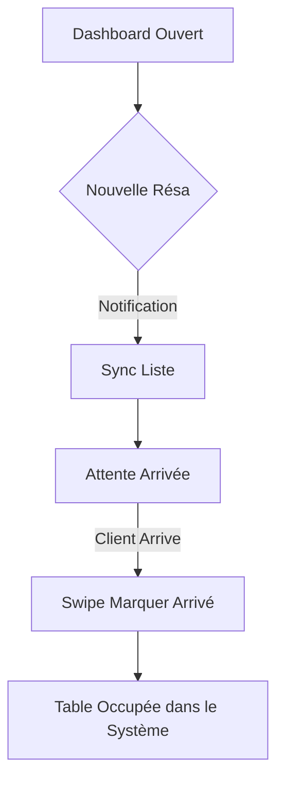

# UX Design Specification Bmad

**Author:** L.vasseur
**Date:** 2026-02-12

---

## Executive Summary

### Project Vision
Bmad est un système de réservation SaaS "Realtime-First". Sa vision UX est de supprimer toute friction entre le désir de réserver d'un client et la gestion opérationnelle d'un restaurateur, en misant sur la fluidité du temps réel et la robustesse technologique.

### Target Users
- **Thomas (Restaurateur) :** Expert métier, utilise le dashboard sur tablette en environnement stressant. Besoin de haute lisibilité et d'actions tactiles rapides (< 48px).
- **Julie (Cliente) :** Utilisatrice mobile, cherche rapidité et réassurance. Besoin d'un tunnel de réservation sans friction et d'un contrôle total (annulations/RGPD).

### Key Design Challenges
- **Lisibilité sous stress :** Concevoir une interface dashboard qui hiérachise l'information critique (ex: allergies, arrivées imminentes).
- **Feedback Temps Réel :** Indiquer les mises à jour (nouvelles résas, annulations) sans distraire Thomas de son service en salle.

### Design Opportunities
- **Expérience Full-Mobile (Julie) :** Exploiter la légereté du web (Next.js) pour une expérience "App-like" sans téléchargement.
- **Micro-interactions tactiles :** Utiliser Shadcn/UI pour des feedbacks visuels instantanés sur les changements de statut (Arrivé / No-show).

## Core User Experience

### Defining Experience
L'expérience Bmad se définit par la synchronisation parfaite entre l'intention du client et la capacité du restaurant. C'est une plateforme de "mise en relation capacitaire" en temps réel.

### Platform Strategy
- **Restaurateur :** Progressive Web App (PWA) optimisée pour tablettes tactiles 10 pouces. Focus sur la réactivité et le mode hors-ligne.
- **Client :** Mobile-First Web Experience. Navigation "one-hand" pour une réservation en 3 étapes maximum.

### Effortless Interactions
- **Smart Booking Flow :** Julie sélectionne date/personnes, et le système ne lui montre QUE les heures disponibles (zéro échec).
- **Status Swiping :** Thomas change le statut d'une table (Arrivé/No-show) par un simple geste latéral sur sa liste.

### Critical Success Moments
- **The "Done" Moment :** Pour Julie, l'écran de succès avec le bouton "Ajouter au calendrier".
- **The "Rush" Monitor :** Pour Thomas, la vue "Service en cours" qui affiche dynamiquement les 3 prochaines arrivées.

### Experience Principles
- **Clarity under Pressure :** Priorité absolue à la lisibilité des noms et des alertes (allergies).
- **Realtime Trust :** Synchronisation visible (indicateur de "Live") pour garantir la confiance dans les données.
- **Elegant Simplification :** Supprimer tout champ de saisie non vital pour accélérer le processus.

## Desired Emotional Response

### Primary Emotional Goals
L'objectif est de transformer une contrainte logistique (réserver/gérer) en un moment de productivité fluide et rassurant. La Sérénité pour le client, la Maîtrise pour le restaurateur.

### Emotional Journey Mapping
- **Julie :** Curiosité (Page d'accueil) → Focus (Saisie) → Soulagement (Confirmation) → Confiance (Rappel).
- **Thomas :** Préparation (Avant service) → Maîtrise (Pendant le rush) → Récompense (Fin de service, bilan).

### Micro-Emotions
- **Trust :** Induit par la synchronisation temps réel visible.
- **Ease :** Induit par la suppression de tout champ de saisie non vital.
- **Gratification :** Induit par des animations de transition fluides (Shadcn/UI).

### Design Implications
- **Sérénité (Julie) :** Typographie claire, espaces blancs (White space) généreux, feedback visuel immédiat.
- **Maîtrise (Thomas) :** Dashboard haute performance, contrastes élevés, boutons tactiles larges pour éviter les erreurs.

### Emotional Design Principles
- **No-Doubt Policy :** Ne jamais laisser l'utilisateur dans l'incertitude sur l'état d'un processus.
- **Supportive Resilience :** En cas d'erreur ou d'indisponibilité, proposer toujours une issue positive.
- **Proactive Empathy :** Afficher les informations critiques (allergies) avant même que l'utilisateur ne les cherche.

## UX Pattern Analysis & Inspiration

### Inspiring Products Analysis
- **SaaS de Delivery (Uber Eats) :** Pour la gestion de l'état en temps réel and la réassurance par notifications.
- **Systèmes POS (Square) :** Pour l'ergonomie tactile en milieu professionnel (boutons > 48px, contrastes élevés).
- **Checkout e-commerce :** Pour la conversion fluide and l'absence de distractions dans le tunnel.

### Transferable UX Patterns
- **Progressive Disclosure :** Ne montrer que les informations nécessaires à l'étape actuelle (ex: ne demander les allergies qu'après avoir choisi l'heure).
- **Contextual Actions :** Sur le Dashboard, ne montrer les boutons "Arrivé/No-show" que pour les réservations de l'heure actuelle.
- **Micro-copy réconfortante :** Utiliser des messages comme "On vous garde une table !" au lieu de "Saisie validée".

### Anti-Patterns to Avoid
- **Data Overload :** Afficher trop de colonnes sur tablette (nom, tel, mail, date, heure, table...). On se concentre sur : Heure | Nom | Couverts | Allergie.
- **Hidden Confirmation :** Forcer l'utilisateur à scroller pour voir si son action a réussi.

### Design Inspiration Strategy
- **Adopter :** Le tunnel de réservation linéaire (Julie) and les cartes d'état interactives (Thomas).
- **Adapter :** La gestion du temps réel pour qu'elle soit informative mais jamais bloquante (notification "Toast" discrète).
- **Éviter :** Toute navigation multi-niveaux complexe. Tout doit être accessible en 2 clics/taps maximum.

## Design System Foundation

### Design System Choice
**Shadcn/UI + Tailwind CSS (Style : Slate/Zinc base)**
Utilisation de la bibliothèque de composants Shadcn/UI comme fondation structurelle, augmentée par des utilitaires Tailwind personnalisés.

### Rationale for Selection
- **Efficacité Tactile :** Les composants Radix UI sous-jacents sont extrêmement performants sur tablettes and mobiles (gestion des focus, targets tactiles).
- **Consistance de l'Architecture :** Aligné avec le starter kit BakerKit and les outils déjà prévus (pénurie de dette technique).
- **Maintenance :** Système "Copy-paste" permettant une modification atomique de chaque composant si les besoins métier de Thomas évoluent.

### Implementation Approach
- Installation via le CLI Shadcn.
- Utilisation de `next-themes` pour gérer un Dark Mode natif sur le Dashboard (Maîtrise).
- Priorité aux composants : `Drawer` (Mobile Julie), `DataTable` & `Popover` (Dashboard Thomas), `InputOTP` (Confirmations).

### Customization Strategy
- **Tokens de Rayon (Radii) :** Utilisation d'arrondis généreux (`rounded-xl`) pour un aspect moderne and accueillant (Sérénité).
- **Palette de Status :** Définir des couleurs sémantiques strictes pour le temps réel (ex: `success` pour confirmé, `warning` pour alerte allergie, `destructive` pour annulation).
- **Typography :** Intégration d'une police sans-serif moderne (ex: Inter ou Geist) optimisée pour la lecture sur écran.

## 2. Core User Experience Detail

### 2.1 Defining Experience
L'interaction maîtresse est le **"Live-Unlock"**. Pour Julie, c'est l'apparition instantanée de la confirmation. Pour Thomas, c'est la mise à jour fluide de sa salle sans rafraichissement de page.

### 2.2 User Mental Model
- **Julie :** "C'est comme envoyer un WhatsApp au restaurant." Le système doit être conversationnel and immédiat.
- **Thomas :** "C'est mon carnet papier, mais avec des yeux partout." Le système doit être une extension naturelle de sa vision de la salle.

### 2.3 Success Criteria
- **Julie :** Recevoir le token de confirmation en < 500ms après le clic final.
- **Thomas :** Identifier une table libre dans les 2 prochaines heures en une seule lecture visuelle.
- **Global :** Taux d'abandon du tunnel de réservation < 5%.

### 2.4 Novel UX Patterns
- **The Tactile Timeline :** Une vue de service où les réservations sont des blocs déplaçables au doigt pour optimiser l'occupation des tables.
- **Optimistic State Badges :** Mise à jour visuelle des statuts (Arrivé / En retard) avant même la confirmation réseau.

### 2.5 Experience Mechanics
1. **Initiation (Julie) :** Scan du QR Code ou clic sur lien Insta → Ouverture immédiate de la WebApp.
2. **Interaction (Julie) :** Sélection Heure/Pers via des tuiles larges → Saisie nom/contact simplifiée.
3. **Initiation (Thomas) :** Tablette toujours allumée sur le pass → Notification sonore "douce" pour chaque nouvelle résa.
4. **Interaction (Thomas) :** Swipe latéral sur une résa pour marquer l'arrivée → La table passe en "Occupé" partout.

## Visual Design Foundation

### Color System
**Thème Global : "Shadow & Copper"**
- **Primary (Accent) :** `#D97706` (Amber/Copper) - Évoque la chaleur humaine and le cuivre des cuisines.
- **Surface (Client) :** `#FAFAF9` (Stone 50) - Fond clair and serein.
- **Surface (Thomas) :** `#09090B` (Zinc 950) - Fond sombre pour réduire la fatigue oculaire and maximiser les contrastes.
- **Semantic Mapping :** 
    - `Success` : Emerald-500 (Confirmation). 
    - `Alert` : Rose-500 (Annulation/Allergie).

### Typography System
**La Dualité Visuelle :**
- **Headings & Client UI :** `Outfit` (Sans-serif géométrique mais douce) ou `Fraunces` (Soft-Serif). Donne un aspect premium and accueillant.
- **Data & Dashboard UI :** `Inter` ou `Geist Sans`. Optimisée pour la lecture rapide de tableaux, chiffres and horaires.
- **Scale :** Utilisation d'une échelle typographique Major Second (1.125) pour la clarté.

### Spacing & Layout Foundation
**Optimisation par Usage :**
- **Client (Airy) :** Padding généreux (`p-8`), arrondis larges (`rounded-2xl`), cartes flottantes. Focus sur une colonne centrale unique.
- **Restaurant (Efficient) :** Padding compact (`p-2`), arrondis précis (`rounded-md`), structure multi-colonnes (Grid/Table).
- **Unité de Base :** 4px (p-1) pour le Dashboard, 8px (p-2) pour le Client.

### Accessibility Considerations
- **Contraste :** Respect strict du ratio WCAG AA (4.5:1) minimum sur tous les textes.
- **Targets Tactiles :** Boutons Dashboard Thomas > 48x48px pour éviter les erreurs de saisie en plein rush.
- **Dark Mode :** Implémentation native via Tailwind pour Thomas (confort visuel de nuit).

## Design Direction Decision

### Design Directions Explored
- **Direction 1: "Sérénité Cuivrée" (Julie - Mobile)** : Focus sur l'aération, la typographie premium (Outfit) and la réduction du stress lié à la réservation.
- **Direction 2: "Maîtrise Ardoise" (Thomas - Tablette)** : Focus sur la densité d'information, le mode sombre pour la concentration and la réactivité tactile en plein rush.

### Chosen Direction
Validation de la **stratégie de dualité d'interface**. Le produit s'exprime différemment selon le contexte d'usage : une expérience Boutique pour le client and un outil Chirurgical pour le restaurateur.

### Design Rationale
- **Adaptabilité Contextuelle :** Julie a besoin de réassurance and de calme ; Thomas a besoin de vitesse and de précision chirurgicale.
- **Optimisation Hardware :** Le Dashboard profite des contrastes élevés du mode sombre on tablette, tandis que la WebApp Julie mise sur la clarté and l'élégance pour séduire.

### Implementation Approach
- Utilisation de classes Tailwind conditionnelles basées sur le rôle de l'utilisateur.
- Partage des tokens de couleurs "Copper" (`#D97706`) comme fil conducteur de la marque sur les deux interfaces pour garantir l'unité.

## User Journey Flows

### Tunnel de Réservation Express (Julie)

Le parcours client est conçu pour être linéaire and sans distraction, minimisant le nombre de choix par écran.

### Gestion du Flux en Direct (Thomas)

Le dashboard de Thomas est un outil de monitoring actif où chaque interaction est optimisée pour le "temps réel".

### Journey Patterns
- **Navigation :** Pas de menu "Hamburger", navigation par onglets ou gestuelle (Swipe).
- **Feedback :** Utilisation systématique de Toasts and de retour haptique (vibration sur mobile).
- **Decision :** Boutons segmentés pour éviter les dropdowns interminables.

### Flow Optimization Principles
- **Réduction du bruit :** Uniquement les actions critiques affichées.
- **Vitesse de saisie :** Utilisation de claviers numériques natifs pour les couverts/téléphone.
- **Clarté du statut :** Couleurs sémantiques immédiates (Confirmé/Allergie/Annulé).

## Component Strategy

### Design System Components
- **Shadcn/UI Base :** Utilisation intensive de `Drawer` (Julie), `DataTable` (Thomas), `Toast` (Système), and `InputOTP` (Vérification téléphone).
- **Radix UI Primitive :** Exploitation de `Slot` pour garantir une personnalisation totale des composants de base.

### Custom Components

#### The Slot-Selector
- **Anatomy :** Grille adaptative de tuiles interactives.
- **Micro-interaction :** Animation "Scale-up" au tap and mise à jour optimiste du statut.
- **Accessibility :** Support complet du lecteur d'écran (Label : "[Heure] - Disponible/Complet").

#### The Tactile Timeline
- **Anatomy :** Canvas horizontal synchronisé en temps réel (via WebSockets).
- **Interaction :** Drag & Drop natif pour optimiser le plan de salle sans rafraichissement.

### Component Implementation Strategy
- **Isolation :** Tous les composants custom héritent des tokens CSS (Copper, Ardoise).
- **Performance :** Utilisation de `React-Window` ou virtualisation pour les timelines denses afin de garantir 60 FPS sur tablettes.

## UX Consistency Patterns

### Button Hierarchy
- **Action Primaire :** Fond plein Copper, texte blanc. Rayon de 12px (Client) / 6px (Thomas).
- **Action Secondaire :** Bordure Slate-200.
- **Feedback Tactile :** Effet de pression (scale 0.98) immédiat au clic.

### Feedback Patterns
- **Success :** Validation visuelle "Done" avec micro-confetti on mobile pour l'effet "Wow".
- **Realtime Sync :** Un badge "Live" pulse discrètement pour rassurer Thomas sur la connexion.

### Form Patterns
- **Mobile Optimized :** Champs de saisie occupant 100% de la largeur sur mobile.
- **Error Handling :** Focus automatique sur le premier champ en erreur.

### Navigation Patterns
- **Thomas :** Sidebar fixe à gauche sur tablette, permettant un basculement rapide entre "Salle", "Liste" et "Paramètres".
- **Julie :** Barre de progression en haut du tunnel (3 étapes).

## Responsive Design & Accessibility

### Responsive Strategy
- **Restaurateur (Tablette First) :** Navigation latérale optimisée pour le pouce gauche, boutons d'action à droite.
- **Client (Mobile First) :** Tunnel de réservation "Bottom-heavy" pour une utilisation facile à une main.

### Accessibility Strategy
- **Compliance Level :** WCAG 2.1 AA.
- **Visuals :** Palette de couleurs testée pour le daltonisme (Deutéranopie/Protanopie).
- **Semantics :** HTML5 sémantique strict (<main>, <nav>, <section>) pour une structure de page claire.

### Implementation Guidelines
- **Units :** Utilisation de `rem` pour la typographie (adaptabilité à la taille de police système).
- **Images :** Attributs `alt` obligatoires pour toutes les icônes métier (ex: icône "Allergie").
